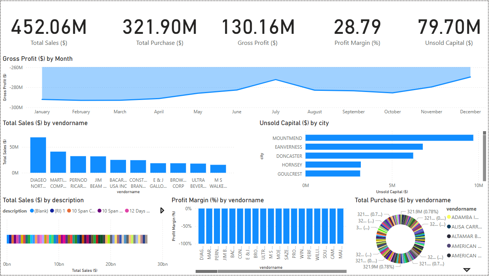

# 📊 Vendor Performance Analytics Dashboard  

A comprehensive end-to-end business intelligence project analyzing vendor performance for a liquor retail business. This solution integrates data cleaning, transformation, and visualization using Python, SQL principles, and Power BI.

---

## 📌 Project Objective  

To track vendor performance, sales trends, purchasing activity, inventory positions, and gross profitability metrics through an interactive and professional Power BI dashboard.

---

## 📂 Project Structure  

📦 Vendor_Performance_Analytics/
┣ 📁 data_sample/
┣ 📁 scripts/
┣ 📁 screenshots/
┣ Vendor_Performance.pbix
┣ README.md

**Folders & Files:**
- `data_sample/` — Sample cleaned datasets for testing and demonstration  
- `scripts/` — Python scripts used for data cleaning and preprocessing  
- `screenshots/` — Dashboard visual previews  
- `Vendor_Performance.pbix` — Final Power BI dashboard file  
- `README.md` — Project documentation  

---

## 📈 Key Performance Indicators (KPIs)

- **Total Sales ($)**  
- **Total Purchases ($)**  
- **Gross Profit ($)**  
- **Profit Margin (%)**  
- **Unsold Inventory Capital ($)**  
- Sales Trends Over Time  
- Vendor Purchase Distribution  
- Product Sales Breakdown  

---

## 📊 Dashboard Preview  

---

### 📦 Cleaned Dataset Access
Due to large file size constraints, the cleaned datasets are hosted on Google Drive:

👉 [Download Cleaned Vendor Performance Datasets](https://drive.google.com/drive/folders/1y43D-QkxqjUWIdSjDanc38tTW8UNF4b2?usp=sharing)

This includes:
- `cleaned_begin_inventory.csv`
- `cleaned_end_inventory.csv`
- `cleaned_purchase_prices.csv`
- `cleaned_purchases.csv`
- `cleaned_sales.csv`
- `cleaned_vendor_invoice.csv`

---

### 📊 Dashboard Features
The Power BI dashboard delivers insights such as:
- 📈 **Total Sales, Purchases, Gross Profit, Profit Margin, and Unsold Capital**
- 🏆 **Top Vendors by Sales and Profitability**
- 🌍 **Unsold Capital by City**
- 📦 **Product-wise Sales Breakdown**
- 📊 **Gross Profit Trend Over Time**
- 📌 **Purchase Contribution Percentage by Vendor**

---

### 🛠️ Tools & Technologies
- **Python (Pandas, NumPy)**
- **Power BI**
- **Google Drive** (for dataset hosting)
- **Visual Studio Code**

---

### 📌 How to Use
1. Download the cleaned datasets from the [Google Drive link](https://drive.google.com/drive/folders/1y43D-QkxqjUWIdSjDanc38tTW8UNF4b2?usp=sharing).
2. Open the Power BI dashboard `.pbix` file.
3. Load the datasets into the dashboard.
4. Interact with the visuals to explore insights.

---

### 📊 Key Insights
- Identified top vendors contributing to total sales.
- Tracked unsold inventory value across cities.
- Analyzed gross profit trends and profit margin distribution.
- Visualized purchase distribution among vendors.

---

### 📨 Contact
**Lakshay Singh**  
📧 lakshaysingh6255@gmail.com  
